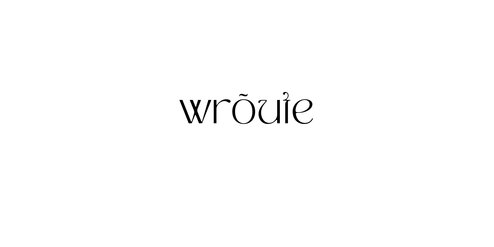

<p align="center">
  
</p>

[](https://bundlephobia.com/result?p=wroute)
[](https://www.npmjs.com/package/wroute)
[](https://www.npmjs.com/package/wroute)

## wroute
> typed http router with constant access time.


```shell
pnpm add wroute
```

## features

- constant access time
- no-dependencies
- typed

## usage
- [`404`] status when request is to a missing **endpoint**
- [`405`] status when request is to a missing **method**

```js
import { router } from 'wroute'
import { IncomingMessage as Request, ServerResponse as Response } from 'node:http'

const port = Number(process.env.PORT || 3000)
const host = String(process.env.HOST || `0.0.0.0`)

const server = createServer(
  router({
    '/': {
      GET: async (req: Request, res: Response) => {
        res.writeHead(200, { 'Content-Type': 'application/json' })
        res.end(JSON.stringify({ content: 'Hello World!' }))
      },
    },
  })
)

server.listen(port, host, () => console.log(
  `🚀 Server is running! | Listening on http://${host}:${port}. | To stop the server, press CTRL+C`
))
```

###### :rocket: launch the server
```
» node --watch --env-file=.env -r ts-node/register server
🚀 Server is running! | Listening on http://0.0.0.0:3000. | To stop the server, press CTRL+C
```

###### `200`
```
» curl -s 'http://0.0.0.0:3000' | yq .content
Hello World!
```

###### `404`
```
» curl -sI 'http://0.0.0.0:3000/nope'
HTTP/1.1 404 Not Found
Content-Type: text/plain
...
```

###### `405`
```
» curl -sI 'http://0.0.0.0:3000'
HTTP/1.1 405 Method Not Allowed
Content-Type: text/plain
...
```

## Licenses

[](license)

---
[`404`]: #404
[`405`]: #405